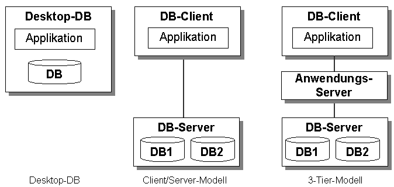
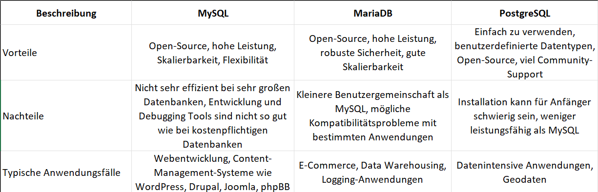

# Lernportfolio M141

## Tag 1

Desktop Datenbanken sind Datenbanken welche auf einem einzelnen PC laufen kann, und dafür da ist um kleinere Mengen an daten zu sichern.

Der DB-Client sind Clients die von den Diensten des Servers profitieren und die auch nutzen. Kurz gesagt griefen diese Geräte auf die Datenbank zu. Darum auch die Verbindung.
Der DB-Server ist die eigene Datenbank mit den Dateisystemen und den Daten.

Beim Tier-3 Modell ist es fast das gleiche wie beim Client/Server Modell, nur dass das Aufrufen der Datenbank und das Bearbeiten nicht auf der gleichen Schicht sind. Aufgerufen wird es per CLient und bearbeitet per Anwendungs-Server. Der DB Server ist wieder die Datenbank.

So kommt man per cmd auf die Datenbank:
cd C:/
cd xampp2
cd mysql
cd bin
.\mysql -u root -p

Hier die Vor- und Nachteile und Typische Anwendungsfällen.

