# Lernportfolio M141

## Tag 1


Desktop Datenbanken sind Datenbanken welche auf einem einzelnen PC laufen kann, und dafür da ist um kleinere Mengen an daten zu sichern.

Der DB-Client sind Clients die von den Diensten des Servers profitieren und die auch nutzen. Kurz gesagt griefen diese Geräte auf die Datenbank zu. Darum auch die Verbindung.
Der DB-Server ist die eigene Datenbank mit den Dateisystemen und den Daten.

Beim Tier-3 Modell ist es fast das gleiche wie beim Client/Server Modell, nur dass das Aufrufen der Datenbank und das Bearbeiten nicht auf der gleichen Schicht sind. Aufgerufen wird es per CLient und bearbeitet per Anwendungs-Server. Der DB Server ist wieder die Datenbank.


So kommt man per cmd auf die Datenbank:
cd C:/
cd xampp2
cd mysql
cd bin
.\mysql -u root -p


Hier die Vor- und Nachteile und Typische Anwendungsfällen.


## Tag 2

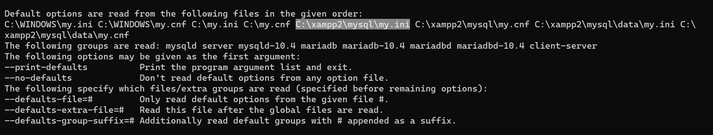

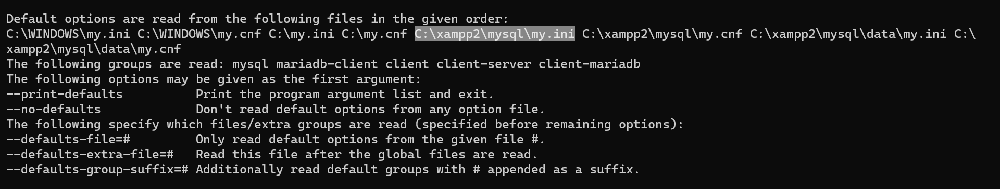


So legt man die Kollation in SQL fest (Beispiel): <br>

```mysql
CREATE TABLE Personen (
    Nachname VARCHAR(100) CHARACTER SET utf8mb4 COLLATE utf8mb4_german2_ci
);
```

Um die Reihen zu sortieren kann man auf die Kollationen in der obersten Reihe klicken um die Spalten zu sortieren.

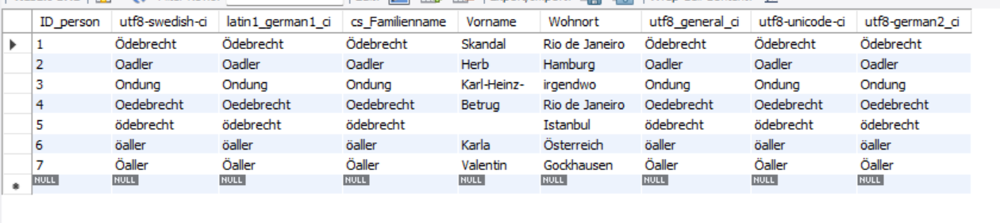


Um Nachnamen einzufügen kann man folgendes Script benützen: <br>

```mysql
INSERT INTO Personen (Nachname) VALUES ('Müller'), ('Mueller'), ('Muller'), ('Straus'), ('Strauss'), ('Strauß'), ('Über'), ('Ueber'), ('Uber');
```

Um die Kollation in Workbench zu ändern kann man Alter Table benutzen: <br>

```mysql
ALTER TABLE Personen MODIFY Nachname VARCHAR(100) CHARACTER SET utf8mb4 COLLATE utf8mb4_german2_ci;
```

Im phpMyqdmin kann man auf dem Dashboard die Kollation auswählen: <br>

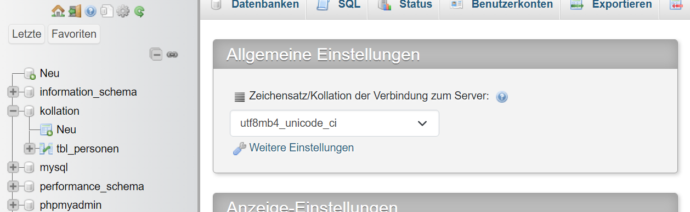


| **Tätigkeit**                         | **SQL-Befehl**                                               | **Grp** | **** |
|---------------------------------------|--------------------------------------------------------------|---------|-------------------------------------|
| 1) alle Daten einer Tabelle anzeigen  | SELECT * FROM [Table Name]                                        | DML     | Der Befehl kann gefährlich werden wenn man mega viele Sachen hat in der Datenbank hat |
| 2) Datenbank auswählen                | USE [Database Name]                                               | DCL     | Ist nicht gefährlich |
| 3) eine neue Datenbank erstellen      | CREATE [Database Name]                                            | DDL     | Kann zu Verwechslungen führen wenn doppelte Einträge vorhanden sind |
| 4) eine neue Tabelle erstellen        | CREATE TABLE Personen (Nachname VARCHAR(100) CHARACTER SET utf8mb4 COLLATE utf8mb4_german2_ci) | DDL | Kann zu Verwechslungen führen wenn doppelte Einträge vorhanden sind |
| 5) eine Tabelle löschen               | DROP TABLE [Table Name]                                           | DDL     | Ist gefährlich, kann nicht rückgängig gemacht werden, ausser mit Rollback |
| 6) Tabellenstruktur **kontrollieren** | DESC [Tabellen Namen] | DDL | Nich gefährlich|
| 7) Datenbanken anzeigen               | SHOW DATABASES | DCL | Nicht gefährlich |
| 8) Tabellen einer DB anzeigen         | SHOW TABLES | DCL | Nichr gefährlich |
| 9) Daten in eine Tabelle eintragen    |INSERT INTO [Tabellen Namen] [Spalte1, Spalte2] VALUES [Wert1, Wert2] | DML | Kann sachen überschreiben |
| 10) Daten in einer Tabelle ändern     | UPDATE [Tabelle] SET [Spalte1] = '[neuer Wert]' WHERE ]Bedingung] | DML | Kann sachen überschreiben |
| 11) Daten in einer Tabelle löschen    | DELETE FROM [Tabellen Name] WHERE [Bedingung] | DML | Ist gefährlich, kann nicht rückgängig gemacht werden, ausser mit Rollback |
| 12) Spalte in einer Tabelle löschen   | ALTER TABLE [Tabellen Name] DROP COLUMN [Spalte] | DDL | Ist gefährlich, kann nicht rückgängig gemacht werden, ausser mit Rollback |


Um die Daten in die Tabelle einzufügen kann man phpmyadmin benutzen. Oben auf Import klicken und "CSV using LOAD DATA" auswählen:

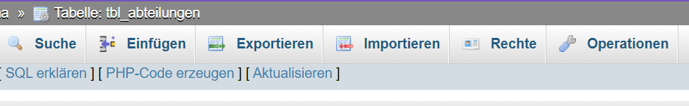


## Tag 3


Seit Mai 2000 ist der Tabellentyp BDB (Berkley Database – Key/Value-DB) integriert, der auch Transaktionen unterstützt. Jetzt gibt es noch InnoDB und Gemini. Damit sind jetzt auch Techniken möglich, die jedes professionelle relationale Datenbanksystem einfach integriert haben muss. Der Tabellentyp von MySQL ist MyISAM und kennt keine Transaktionsunterstützung.

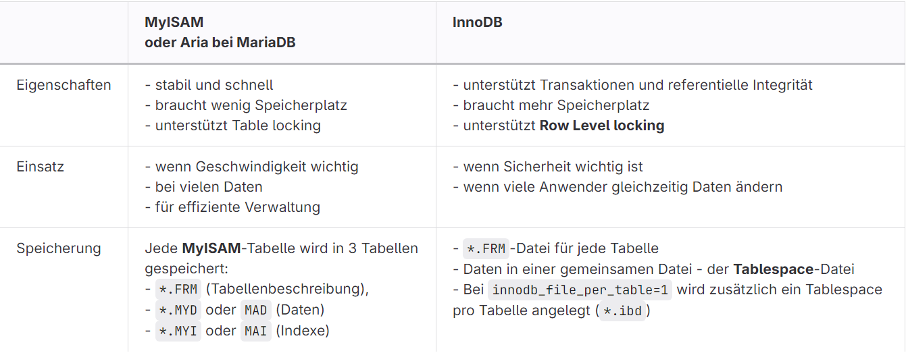

Befehle: <br>

```mysql
ALTER TABLE benutzer ENGINE = InnoDB;
```

```mysql
SHOW TABLE STATUS LIKE 'benutzer';
```
<br>

Standardmässig wird beim ersten Start von MySQL die Datei ibdata1 mit einer Grösse von 10 MByte (oder 12MB je nach Version) erzeugt. Sobald die darin gespeicherten InnoDB-Tabellen mehr Platz beanspruchen, wird die Datei in 8-MByte-Schritten vergrössert

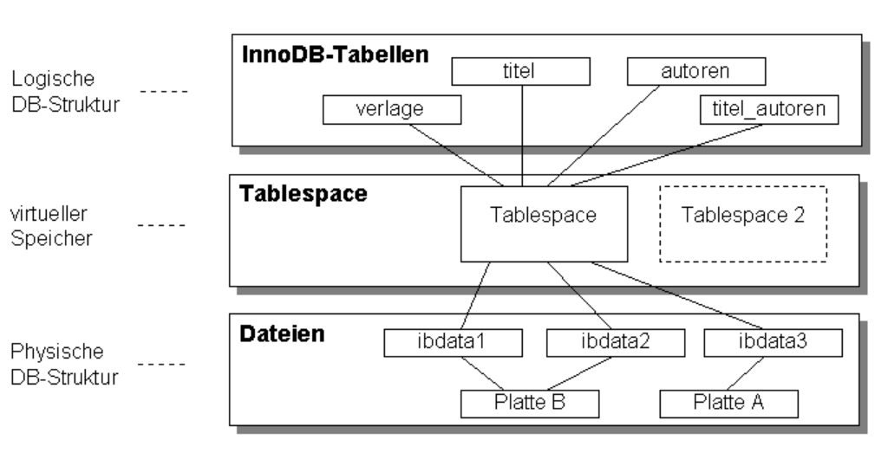

Wenn Sie feststellen möchten, wie viel Speicherplatz innerhalb des Tablespace noch frei ist, führen Sie folgenden SQL-Befehl aus:

```mysql
SELECT SPACE,NAME,ROUND((ALLOCATED_SIZE/1024/1024), 2) as "Tablespace Size (MB)"  FROM information_schema.INNODB_SYS_TABLESPACES ORDER BY 3 DESC;
```

## Tag 4

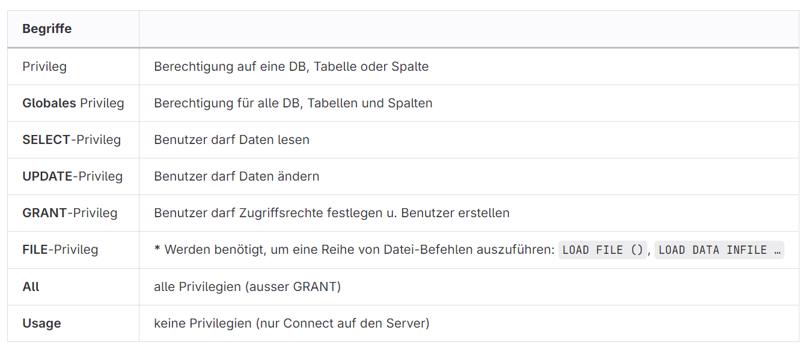

User mit Passwort erstellen:<br>
```mysql
CREATE USER 'user'@'hostname' IDENTIFIED BY 'Passw0rt';
```
Ohne Passwort ist genau das gleiche, nur ohne den Schluss:<br>
```mysql
CREATE USER 'user'@'hostname';
```

Berechtigungen festlegen:<br>
```mysql
GRANT privileg1 [, privileg2, ...]
ON [datenbank.]tabelle
TO user@host [IDENTIFIED BY 'passwort'] [WITH GRANT OPTION] ;
```

Berechtigungen entfernen:<br>
```mysql
REVOKE privileg1 [, privileg2, ...]
ON [datenbank.]tabelle
FROM user@host ;
```

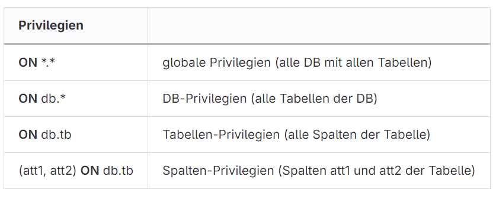

Hier sieht man wie es aussieht wenn man eine Rolle erstellt zusammen mit einem Benutzer, und gleich die Rolle zuweist:<br>
```mysql
CREATE ROLE rolle;
GRANT SELECT, INSERT, UPDATE, DELETE ON db.tbl TO rolle;  -- Rolle wird erzeugt
GRANT SELECT, ... ON db.tbl TO user@hostname IDENTIFIED BY 'Passw0rd'; -- User wird erzeugt!
GRANT rolle TO user@hostname;  -- Rolle wird User übertragen                     
FLUSH PRIVILEGES;                                  -- Aktivierung -- nie vergessen!

SELECT CURRENT_ROLE;  -- Aktive Rollen für aktuellen Benutzer werden angezeigt (Standard NULL - also keine)
SET ROLE rolle;       -- Rollen dem aktuellen User zuordnen
```

So könnte eine Zugriffsmatrix aussehen. D = DELETE, U = UPDATE, S = SELECT, I = INSERT<br>

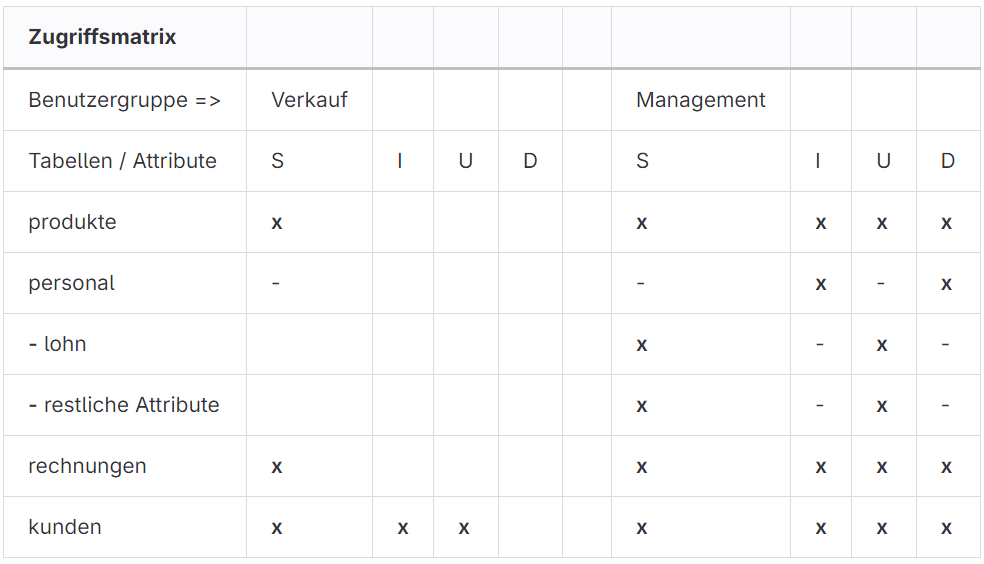

<br>
<br>
Erstellen Sie die zwei Rollen varkauf und management:<br>
```mysql
CREATE ROLE varkauf, management;
```
<br>
Erstellen Sie pro Gruppe einen Benutzer:
```mysql
CREATE USER user1@localhost, user2@localhost;
GRANT varkauf TO user1@localhost;
GRANT management TO user2@localhost;
```
<br>
Um die Berechtigungen festzulegen habe ich folgendes gemacht:<br>
```mysql
GRANT SELECT, UPDATE, INSERT, DELETE ON hotel.buchung TO user1@localhost;
````
Ich habe einfach die hotel Datenbank genommen weil ich die gut fand.
Ich habe die Rollen sowie auch die Benutzer und Table Berechtigungen im mysql.user und mysql.global.priv gefunden. Auch das einloggen hat funktioniert.
Als ich mir die Datenbanken anzeigen liess, sah ich nur mysql und test. Dann habe ich die Rolle festgelegt:<br>
```mysql
SET ROLE varkauf;
```
Danach habe ich auch die hotel Datenbank gesehn und konnte sie bedienen.<br>
Gelöscht habe ich die Rollen und Benutzer wie folgt:<br>
```mysql
DROP ROLE varkauf, management;
DROP USER user1@localhost, user2@localhost;
```

## Tag 5

Verbindung zum DB-Servertesten:<br>
```mysql
mysqladmin -h 172.19.176.1 ping
```
<br>

Über das Netz auf die DB zugreifen:<br>
```mysql
mysql -h 172.19.176.1
```
<br>

Backup und Restore über das Netz ausführen:<br>
```mysql
mysqldump -h 172.19.176.1 [datenbank] \> [datei z.B. datei.txt]
```

## Tag 6

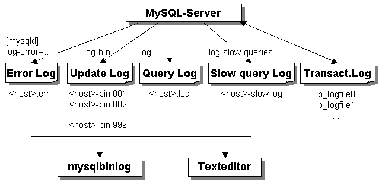
<br>

Der folgende CMD-Befehl startet den DB-Server mit der Option für Fehlermeldungen in Deutsch, aber zuerst muss man ins richtige Verzeichniss:
```
cd C:\xampp\mysql\bin
```
<br>

Danach kann man folgenden Befehl ausführen:
```
mysqld --language=german
```
<br>

Mit folgendem Befehl kann man alle Logs anzeigen lassen:
```mysql
SHOW VARIABLES LIKE '%log%';
```
<br>

Error Log-Datei festlegen (Default: <basedir>\data\<host>.err):
```mysql
log-error=C:/log/error.txt
```
<br>

Logging refreshen macht man mit
```mysql
FLUSH LOGS
```
<br>

Während des Betriebs eines DB-Servers wird regelmässig ein Backup erstellt. Durch einen Crash können sämtliche Daten verloren gehen.

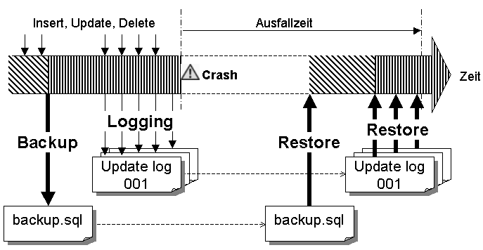
<br>

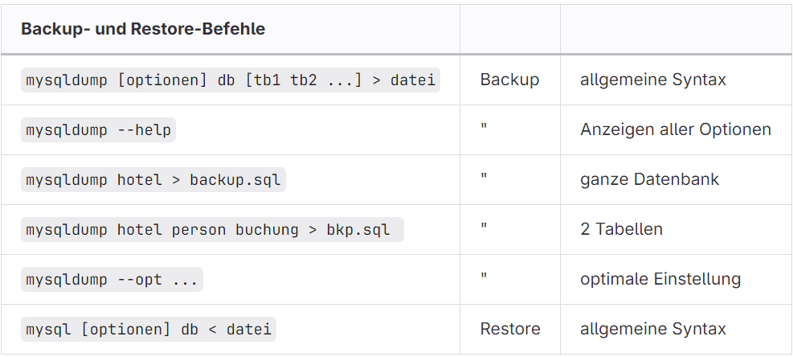
<br>

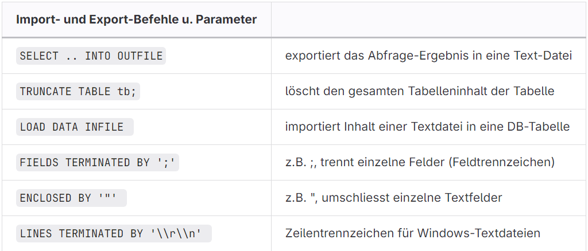
<br>

Der Parameter --opt umfasst folgenden Optionen:

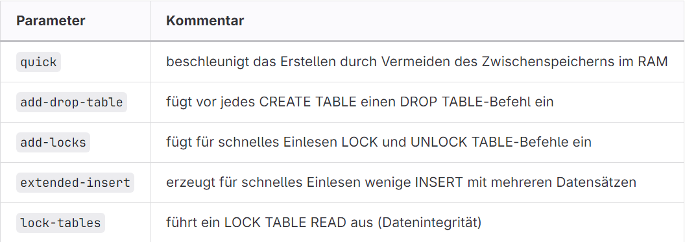
<br>


<br>

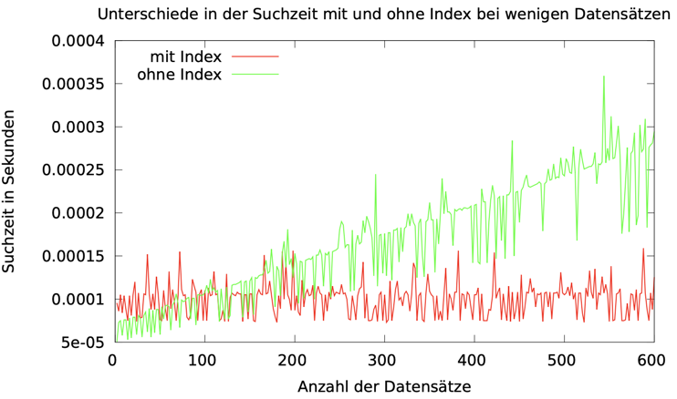
<br>

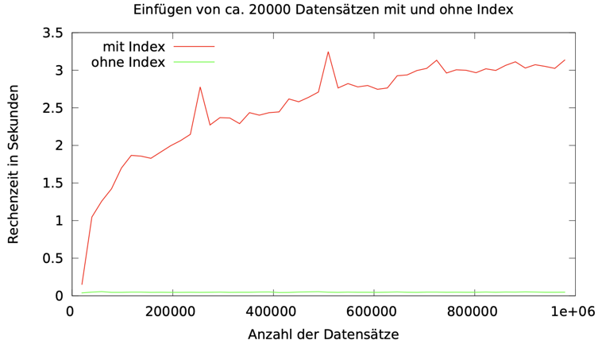
<br>

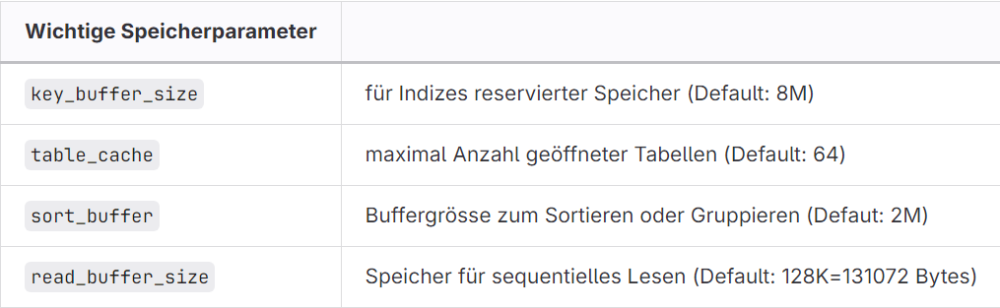
<br>

Beispiel dafür:
```mysql
SET query_cache_type=0;
```

## Tag 7

Rechte anzeigen:<br>
```mysql
SHOW GRANTS FOR [Benutzer];
```
<br>

Daten laden:<br>
```mysql
LOAD DATA INFILE [Pfad zur Datei];
INTO TABLE Person
FIELDS TERMINATED BY ',' 
ENCLOSED BY '"'
LINES TERMINATED BY '\r\n'
IGNORE 1 ROWS;
```
<br>

Index auf einer Tabelle erstellen und Dropen:<br>
```mysql
CREATE INDEX idx_AddresseId ON Person (AdresseId);
DROP INDEX idx_AddresseId ON Person ;
```
<br>

Doppelte Sachen finden:<br>
```mysql
SELECT Id FROM Adresse
GROUP BY Id
HAVING COUNT(Id) > 1
```
<br>

